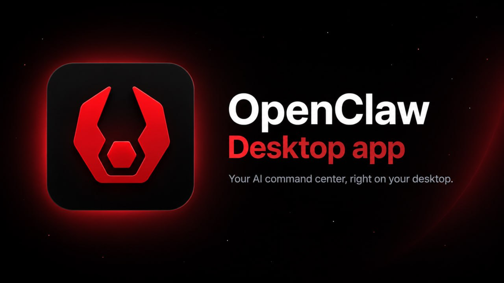

<p align="center">
  
</p>

<h1 align="center">OpenClaw Desktop</h1>

<p align="center">
  A native desktop client for working with OpenClaw</a>.
</p>

<p align="center">
  <a href="#-development">🛠️ Development</a> ·
  <a href="#-repository-layout">🧭 Repository</a> ·
  <a href="#-documentation">📚 Documentation</a> ·
  <a href="./CONTRIBUTING.md">🤝 Contributing</a> ·
  <a href="./SECURITY.md">🔒 Security</a>
</p>

---

## ✨ Overview

OpenClaw Desktop combines a Tauri desktop shell, a Next.js interface, and a local Fastify middleware service that connects to an OpenClaw Gateway.

```text
Tauri desktop shell
        ↓
Next.js user interface
        ↓
Local Fastify middleware + SQLite projection
        ↓
OpenClaw Gateway (WebSocket)
```

The middleware owns the Gateway connection and projects chat state to the UI. The desktop bundle includes the middleware resources needed by the app.

---

## 🛠️ Development

### Requirements

- Node.js 22 or newer
- pnpm 9 or newer
- Access to an OpenClaw Gateway for connection and integration testing

### Run locally

```bash
pnpm install
pnpm dev
```

---

## 🧭 Repository layout

```text
apps/middleware/       Fastify middleware, SQLite projection, Gateway bridge
packages/ui/           Next.js 16 / React 19 interface
packages/desktop/      Tauri shell and Rust source
packages/middleware/   legacy Gateway client library
packages/server/       Node server package
packages/shared/       shared TypeScript types and schemas
docs/                  contributor workflows, constraints, and lessons
```

---

## 📚 Documentation

- [Contributing](./CONTRIBUTING.md)
- [Security policy](./SECURITY.md)
- [Project guidance](./AGENTS.md)

---

## 🤝 Contributing

Please read [CONTRIBUTING.md](./CONTRIBUTING.md) before opening a pull request. Keep changes focused, verify the affected packages, and document durable behavior rules when they are introduced.

## 🔒 Security

Please report vulnerabilities according to [SECURITY.md](./SECURITY.md). Do not post exploit details, credentials, pairing codes, private URLs, or tokens in public issues.
