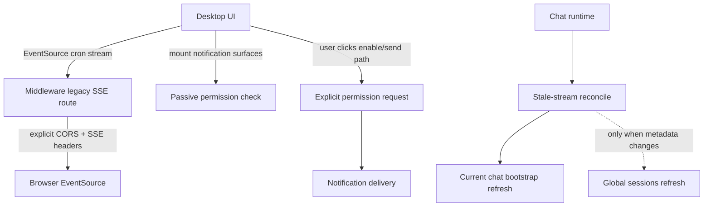

# Desktop Diagnostics Cleanup

## Summary

Fix the reproducible diagnostics surfaced by the Desktop power-user run: cron SSE CORS headers missing on the raw stream response, browser notification permission being requested outside a user gesture, and excessive chat/session polling during active-run reconciliation. Treat Firefox `NS_BINDING_ABORTED` chunk aborts as dev-server noise unless new evidence shows user-visible failure.

---

## Problem Frame

The 15-minute Desktop power-user loop completed without page crashes, but diagnostics showed several noisy or wasteful failure modes. Two are concrete browser errors with clear causal chains: the cron SSE GET response bypasses Fastify CORS headers, and notification permission is requested on popover mount. The polling issue is not a crash, but it creates unnecessary middleware load and makes stress-run diagnostics harder to read.

---

## Requirements

**SSE and browser errors**

- R1. Browser EventSource connections to the cron stream from the Desktop UI origin must receive the same CORS allowance as normal middleware routes.
- R2. Legacy SSE stream routes must keep existing streaming behavior, ready events, heartbeat behavior, and cleanup semantics.
- R3. Browser notification permission must never be requested during passive mount/render effects; it must only be requested from a user-triggered path.
- R4. Existing Tauri notification behavior must remain compatible, including the Windows custom reply notification path.

**Polling and diagnostics quality**

- R5. Active-run reconciliation must avoid repeatedly invalidating global session lists when only the active chat transcript needs refresh.
- R6. Polling fallback paths must remain available for stale streams, subagent completion, edit-preview recovery, and notification activity hydration, but each should have a bounded cadence and clear trigger.
- R7. Stress diagnostics after the change should show no CORS console errors for `/api/stream/cron` and no browser notification permission errors on initial load.

---

## Key Technical Decisions

- KTD1. Patch raw SSE headers at the middleware boundary: the failing response is produced by manual `writeHead`, so the fix should make SSE responses explicitly CORS-safe instead of relying on Fastify hooks that have already been bypassed.
- KTD2. Split notification permission into passive check vs. explicit request: mount effects may read current permission state, but only user actions may call the browser request API.
- KTD3. Reduce global invalidation first, polling interval second: the diagnostics show repeated `/api/sessions` and chat history calls; preserving stream recovery matters more than removing every timer.
- KTD4. Keep dev-only aborted chunk requests out of the fix scope unless they become reproducible production failures; the run had zero page errors and the failures match Firefox navigation/chunk abort behavior.

---

## Implementation Units

### U1. Make legacy cron SSE CORS-safe

- **Goal:** Ensure EventSource GET responses include browser-readable CORS headers while preserving existing SSE behavior.
- **Files:**
  - `apps/middleware/src/features/compat/routes.ts`
  - `apps/middleware/tests/patch-stream.test.ts`
  - `apps/middleware/tests/app.test.ts`
- **Patterns:** Follow the existing CORS preflight coverage in `apps/middleware/tests/app.test.ts` and the cron SSE stream coverage in `apps/middleware/tests/patch-stream.test.ts`.
- **Test Scenarios:**
  - Cron SSE GET with an Origin header returns `access-control-allow-origin` matching the origin.
  - Cron SSE GET still returns `text/event-stream` and emits `event: cron.ready`.
  - Closing the client still clears heartbeat subscriptions without throwing.
- **Verification:** Middleware test run covering `patch-stream.test.ts` and CORS-related app tests.

### U2. Gate browser notification permission behind user intent

- **Goal:** Remove mount-time `Notification.requestPermission()` calls while retaining notification sending once permission exists.
- **Files:**
  - `packages/ui/lib/notifications.ts`
  - `packages/ui/components/notifications/NotificationPopover.tsx`
  - `packages/ui/components/notifications/tabs/ActivityTab.tsx`
  - `packages/ui/components/notifications/tabs/CronJobsTab.tsx`
  - `packages/ui/lib/__tests__/notifications.test.ts` or nearest existing notification test file
- **Patterns:** Keep `checkPermission` as the passive path and introduce or expose an explicit request path for button/click handlers.
- **Test Scenarios:**
  - Mounting notification UI checks permission state without calling browser `requestPermission`.
  - A user-triggered enable action calls the explicit request path once.
  - `notifyChatComplete` sends when permission is already granted and no-ops cleanly when denied.
  - Tauri runtime still uses plugin permission APIs.
- **Verification:** UI unit tests for notification permission behavior plus typecheck.

### U3. Bound active-run reconcile invalidations

- **Goal:** Reduce repeated `/api/commands/middleware_chat_history` and `/api/sessions` calls without weakening stale-stream recovery.
- **Files:**
  - `packages/ui/hooks/useChatMessages.ts`
  - `packages/ui/lib/query.ts`
  - `packages/ui/lib/__tests__/useChatMessages.reconcile.test.ts`
  - `packages/ui/lib/__tests__/tabSwitchRequests.test.ts`
- **Patterns:** Preserve the active-run reconcile guard around stream staleness and the existing `chatBootstrap(sessionKey)` cache contract.
- **Test Scenarios:**
  - Active-run reconcile refreshes the current chat bootstrap when stream events go stale.
  - Global sessions query is invalidated only when session-level metadata changes or a new session is created/deleted.
  - Rapid tab/session switching does not multiply reconcile calls for inactive sessions.
  - Stale stream recovery still updates status/messages when the stream is genuinely quiet.
- **Verification:** Existing reconcile/tab-switch tests plus a focused regression for sessions invalidation count.

### U4. Re-run the focused power-user diagnostic sweep

- **Goal:** Confirm the fixes reduce console/network noise under the same Desktop target and middleware setup.
- **Files:**
  - `outputs/webui-chat-sidebar-activity-20260528T115536Z/final_runs/run_3/final_script.py`
  - `outputs/webui-chat-sidebar-activity-20260528T115536Z/final_runs/run_3/diagnostics.json`
  - New run artifacts under the same output family or a new timestamped run directory
- **Patterns:** Reuse the prior Playwright flow rather than inventing a new harness, so before/after metrics are comparable.
- **Test Scenarios:**
  - No CORS errors for cron SSE on load.
  - No browser notification permission errors on load.
  - `/api/commands/middleware_chat_history` and `/api/sessions` counts are materially lower during an equivalent rapid loop.
  - Page remains stable with zero page errors.
- **Verification:** Final diagnostics summary and screenshot artifacts from the rerun.

---

## High-Level Technical Design

---

## Scope Boundaries

- In scope: CORS headers for legacy middleware SSE routes used by Desktop, browser notification permission gating, and active-run polling/invalidation reductions.
- In scope: focused tests that lock the diagnosed behavior and a short diagnostic rerun.
- Out of scope: replacing the legacy SSE implementation wholesale, changing Gateway contracts, redesigning notification UX beyond the minimum enable/request path, or treating dev-server `NS_BINDING_ABORTED` chunk aborts as product bugs without new evidence.

---

## Risks & Dependencies

- Raw SSE handlers can easily regress headers because they bypass normal Fastify response decoration; tests should assert the GET response headers, not only OPTIONS preflight.
- Notification permission behavior differs between browser and Tauri runtimes; tests need to isolate both branches instead of assuming browser-only behavior.
- Reducing polling too aggressively could hide stale stream recovery bugs. Prefer targeted invalidation gating before removing fallback timers.
- The prior diagnostics came from a dev server run; rerun comparisons should focus on the specific diagnosed errors and request counts, not every dev-only warning.

---

## Acceptance Examples

- AE1. Given the UI runs on `http://127.0.0.1:3000`, when it opens the cron stream on middleware, then the browser accepts the EventSource connection without a CORS console error.
- AE2. Given the notifications popover mounts on initial page load, when the browser has default notification permission, then no permission prompt request is attempted and no permission error is logged.
- AE3. Given the user explicitly enables notifications, when the click handler runs, then notification permission may be requested and the result is cached.
- AE4. Given a chat run is active but stream events are fresh, when the reconcile timer fires, then it does not fetch chat history or invalidate sessions unnecessarily.
- AE5. Given stream events go stale, when reconcile runs, then the active chat can still recover status/messages through the existing bootstrap/history path.

---

## Sources / Research

- `apps/middleware/src/app.ts:71` registers Fastify CORS for normal routes.
- `apps/middleware/src/features/compat/routes.ts:4086` manually writes the cron SSE response headers.
- `packages/ui/lib/ipc.ts:63` builds middleware stream URLs and sends `/api/stream/cron` directly to middleware when configured.
- `packages/ui/lib/notifications.ts:34` contains the permission request path.
- `packages/ui/components/notifications/NotificationPopover.tsx:197` currently calls notification permission handling on mount.
- `packages/ui/hooks/useChatMessages.ts:860` invalidates both chat bootstrap and sessions during reconcile.
- `packages/ui/components/notifications/tabs/ActivityTab.tsx:177` refreshes activity on a fixed interval while also subscribing to the cron stream.
- Prior diagnostics: `outputs/webui-chat-sidebar-activity-20260528T115536Z/final_runs/run_3/diagnostics.json` showed zero page errors, 82 failed requests, and 252 calls each to `/api/commands/middleware_chat_history` and `/api/sessions`.
