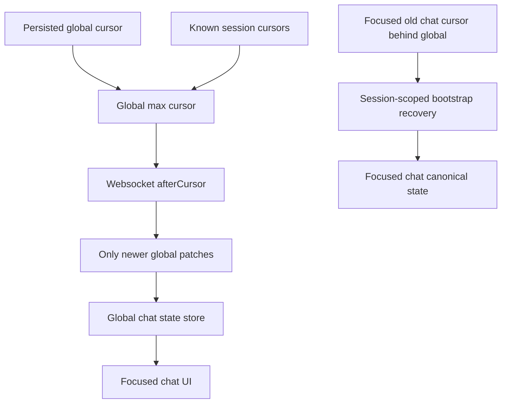

# Global Patch Cursor Monotonic Recovery

## Summary

Prevent old completed chats from resurrecting stale subagent/linking UI by keeping the global patch stream cursor monotonic. Focused old-chat recovery should happen through that chat’s bootstrap/history path, not by rewinding and replaying the global websocket stream across unrelated sessions.

---

## Problem Frame

The attached Desktop logs show an already answered chat opening with `status:"done"`, `pendingToolCount:0`, and `spawnedSubagentCount:0`, followed by a websocket replay of older `chat.tool.started` / `chat.tool.result` patches from another session. That replay happens because the focused chat bootstrap cursor is allowed to lower the global patch cursor. Once lowered, the global engine can apply old patches and recreate stale subagent state that looks like a current link/spinner.

---

## Requirements

**Cursor and replay behavior**

- R1. The global patch cursor must never decrease after it has been restored from storage or advanced by live patches.
- R2. Opening an old completed chat whose session cursor is behind the global cursor must not replay global patches from that older cursor.
- R3. Focused-session recovery must still refresh the opened chat through bootstrap/history when its local cursor is behind or incomplete.
- R4. Normal websocket reconnects must still replay patches newer than the current global cursor.

**Subagent correctness**

- R5. Stale `sessions_spawn` / subagent patches from unrelated old sessions must not create visible subagent links in the focused completed chat.
- R6. Live new `sessions_spawn` tool calls must still show spawning, linked, working, completed, and failed states correctly.
- R7. Active running chats must still recover after reconnect without losing current tools or spawned subagents.

**Diagnostics**

- R8. Logs should no longer show `global-chat-engine.replay-cursor.lowered` for focused old-chat opens.
- R9. If an old focused chat needs recovery, logs should identify per-session bootstrap recovery rather than global stream rewind.

---

## Key Technical Decisions

- KTD1. Treat the patch stream cursor as global process state: it represents all sessions, so a single focused session cannot safely move it backwards.
- KTD2. Move old-chat freshness repair to per-session bootstrap: bootstrap is scoped to one session and already knows how to return canonical messages, tools, run status, and cursor.
- KTD3. Keep websocket replay for forward-only reconnects: replay remains useful when the app reconnects from the latest known global cursor and only needs patches that happened while disconnected.
- KTD4. Keep stale-patch guards as defense in depth, not as the primary fix: the main bug is cursor rewind; stale patch filters should only catch impossible or corrupted cases.

---

## Implementation Units

### U1. Make global stream cursor monotonic

- **Goal:** Remove the path where `replayFromCursor` lowers `globalCursor` before opening the websocket stream.
- **Files:**
  - `packages/ui/lib/chat-engine-v2/store.ts`
  - `packages/ui/lib/chat-engine-v2/__tests__/store.test.ts`
- **Patterns:** Replace the current lowered-cursor behavior with a forward-only cursor policy; keep `restoreGlobalCursor()` and state cursor maxing as the source of the websocket `afterCursor`.
- **Test Scenarios:**
  - Stored cursor is `1000`, focused session asks for replay from `900`, websocket opens with `1000`.
  - Another local session has cursor `980`, focused session asks for replay from `900`, websocket still opens with `1000` or the max known cursor.
  - Live patch at cursor `1001` advances the cursor and persists it.
- **Verification:** Update existing tests that currently assert lowered cursor behavior to assert monotonic behavior.

### U2. Add scoped recovery signal for behind focused sessions

- **Goal:** Preserve old-chat recovery without global replay by emitting or using a session-scoped bootstrap recovery when focused session cursor is behind global cursor.
- **Files:**
  - `packages/ui/lib/chat-engine-v2/store.ts`
  - `packages/ui/hooks/useChatMessages.ts`
  - `packages/ui/lib/chat-engine-v2/__tests__/store.test.ts`
  - `packages/ui/lib/__tests__/useChatMessages.reconcile.test.ts`
- **Patterns:** Reuse the existing `openclaw:chat-bootstrap-recovery` event and the `chatBootstrap(sessionKey)` query path, but ensure the recovery is targeted to the focused session.
- **Test Scenarios:**
  - Focused old session behind global cursor triggers a bootstrap recovery event for that session only.
  - Non-focused sessions are not refetched just because one old chat opened.
  - A completed chat remains `done` after recovery and does not adopt unrelated active tool state.
- **Verification:** Focused recovery test plus hook-level test for applying only matching-session recovery.

### U3. Harden stale replay/subagent application guards

- **Goal:** Ensure stale non-active patches cannot recreate tool/subagent UI when a state is already newer or terminal.
- **Files:**
  - `packages/ui/lib/chat-engine-v2/store.ts`
  - `packages/ui/components/ChatView/index.tsx`
  - `packages/ui/lib/chat-engine-v2/__tests__/store.test.ts`
- **Patterns:** Preserve existing stale-cursor skip behavior and existing `applyStaleMatchingToolPatch` only for matching terminal tool updates, not arbitrary old spawn starts.
- **Test Scenarios:**
  - A stale `chat.tool.started` for an old `sessions_spawn` does not add a spawned subagent to a completed state.
  - A stale terminal result for an already-known matching tool may still update that tool result if allowed by the current stale-tool path.
  - Subagents rendered in `ChatView` remain anchored to the message/tool call that created them, not to global unrelated state.
- **Verification:** Store-level stale patch tests and a render-scope regression if an existing ChatView test harness can cover it.

### U4. Preserve live subagent and reconnect behavior

- **Goal:** Prove the fix does not break legitimate current subagent lifecycle updates.
- **Files:**
  - `packages/ui/lib/chat-engine-v2/__tests__/store.test.ts`
  - `packages/ui/lib/chat-engine-v2/__tests__/client.test.ts`
  - `packages/ui/lib/__tests__/tabSwitchRequests.test.ts`
  - `packages/ui/hooks/useSubagentMessages.ts`
- **Patterns:** Keep `openPatchStreamV2` forward replay semantics and keep child subagent message streaming based on each child session’s own state/cursor.
- **Test Scenarios:**
  - Current `sessions_spawn` start creates a spawning subagent.
  - Spawn result/link updates the same subagent with `sessionKey` and working status.
  - Child completion updates the parent subagent status to completed.
  - Websocket reconnect from current global cursor replays only missed newer patches and still updates active run state.
- **Verification:** Store/client tests plus any existing tab-switch or subagent message tests that exercise reconnect.

### U5. Validate against the attached Desktop scenario

- **Goal:** Reproduce the old-chat open pattern and verify stale subagent linking is gone.
- **Files:**
  - `outputs/` diagnostic run artifacts
  - `packages/ui/lib/clientLogs.ts`
- **Patterns:** Use the same Desktop target and log style from the attached investigation so before/after evidence is comparable.
- **Test Scenarios:**
  - Open an already answered chat with an old bootstrap cursor.
  - Confirm no `global-chat-engine.replay-cursor.lowered` log appears.
  - Confirm no old unrelated `chat.tool.started` patches create visible spawned subagents for the focused chat.
  - Confirm an actually running chat still shows active tools/subagents.
- **Verification:** Focused browser/manual diagnostic log with final status and screenshot if UI confirmation is needed.

---

## High-Level Technical Design

---

## Scope Boundaries

- In scope: frontend global cursor monotonicity, session-scoped bootstrap recovery, stale subagent replay guards, and tests for old completed chats and active running chats.
- In scope: minimal log naming changes needed to distinguish scoped recovery from global replay.
- Out of scope: replacing the patch stream protocol, changing Gateway session history contracts, redesigning subagent UI, or removing websocket replay entirely.
- Out of scope for first pass: backend `ensureRecentSessionsSubscribed(100)` optimization unless frontend tests show it is still causing visible stale state after cursor monotonicity is fixed.

---

## Risks & Dependencies

- If per-session recovery is not triggered when needed, old chats may show stale cached content until manual refresh. This is why U2 must land with U1.
- If stale-patch guards are too broad, legitimate delayed terminal tool results could be dropped. Keep matching terminal tool result behavior explicit.
- Existing tests currently encode the old lowered-cursor behavior, so they must be intentionally rewritten rather than patched around.
- Multi-window Desktop use may depend on localStorage cursor behavior; tests should cover restored cursor plus seeded in-memory session state.

---

## Acceptance Examples

- AE1. Given global cursor `1000` and an opened completed chat with cursor `900`, when the global engine starts, then websocket connects from `1000`, not `900`.
- AE2. Given that old completed chat needs fresh history, when it opens, then only that chat’s bootstrap is refetched and its status remains terminal unless canonical history says otherwise.
- AE3. Given old replay patches contain `sessions_spawn` starts for another session, when they are older than the global cursor, then no subagent bar/link appears in the focused completed chat.
- AE4. Given a currently running chat spawns a subagent, when live patches arrive, then the subagent still appears, links to its child session, and completes normally.
- AE5. Given the websocket disconnects and reconnects, when new patches were produced after the latest global cursor, then those newer patches replay and apply normally.

---

## Sources / Research

- `packages/ui/lib/chat-engine-v2/store.ts:1441` maintains `lastReceivedCursor` and global patch application state.
- `packages/ui/lib/chat-engine-v2/store.ts:1690` starts the global chat engine with `afterCursor: globalCursor`.
- `packages/ui/lib/chat-engine-v2/store.ts:1700` currently lowers `globalCursor` when `replayFromCursor` is below it.
- `packages/ui/hooks/useChatMessages.ts:1471` passes focused chat `replayFromCursor` into `ensureGlobalChatEngine`.
- `packages/ui/hooks/useChatMessages.ts:2035` subscribes focused chat UI to global session state after fresh bootstrap.
- `packages/ui/lib/chat-engine-v2/client.ts:195` opens the websocket patch stream and handles forward replay/backlog behavior.
- `packages/ui/components/ChatView/index.tsx:1408` maps spawned subagents by tool call and renders them from chat state.
- `packages/ui/lib/chat-engine-v2/__tests__/store.test.ts:43` and `:62` currently assert the unsafe lowered-cursor behavior and should be rewritten.
- Attached log evidence showed old chat status `done` with zero spawned subagents, then websocket replay of older tool/subagent patches from another session after a lowered cursor.
