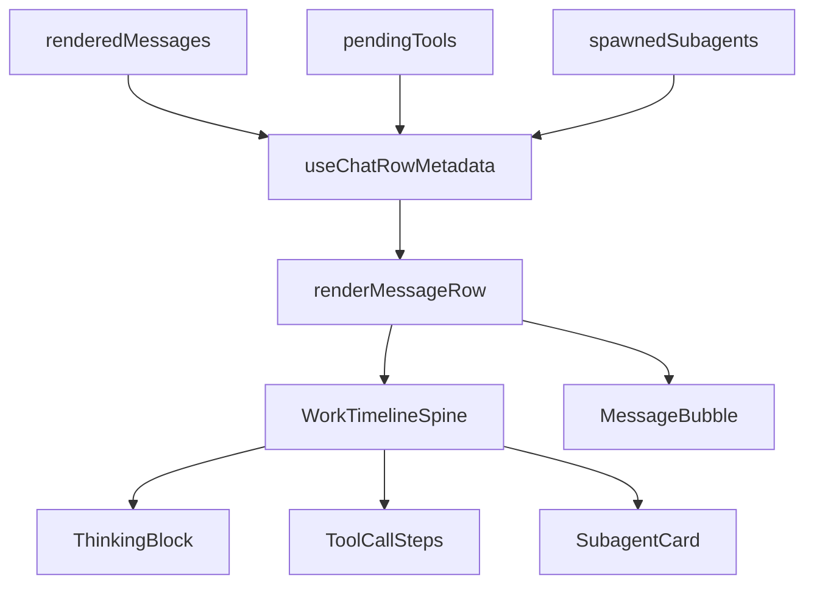

# Unified Work Timeline Spine

## Summary

Build the v1 combined thin slice from the brainstorm: first remove the obvious large-data render hot spots in `ChatView`, then introduce a minimal per-turn Work Timeline Spine that groups thinking, tools, approvals, subagents, and live status without changing backend contracts or reintroducing virtualization.

---

## Problem Frame

The current chat area has the data needed to explain agent work, but the UI scatters it across `ThinkingBlock`, `ToolCallSteps`, bottom status text, pending tools on the user row, `SubagentCard`, and `SubagentBar`. Users supervising long-running work need one turn-attached place to understand what is running, done, failed, and waiting for approval.

At the same time, large transcripts already have jank/blink risk. `ChatView` renders the whole visible list and currently does repeated per-row scans over `renderedMessages`. The plan must improve that path before adding new visual structure.

---

## Requirements

**Large-data stability foundation**

- R1. Replace per-row forward scans for later assistant text with precomputed row metadata.
- R2. Replace per-row `renderedMessages.some(...)` checks for displayed tool IDs with precomputed sets.
- R3. Keep active-turn calculations scoped to the latest turn and reuse precomputed data in row rendering.
- R4. Keep the plain DOM scroll container; do not add virtualization/windowing in this plan.
- R5. Do not add new scroll measurement/write loops for the spine.

**Work Timeline Spine**

- R6. Render a single turn-attached work spine for assistant turns that have reasoning, tool calls, approvals, subagents, or active status.
- R7. Summarize work in chronological/semantic order: thinking, tools, approvals, subagents, live response state.
- R8. In collapsed/default state, show enough information to answer what is running, done, failed, and awaiting approval.
- R9. Multi-tool summaries show status counts and a current running/failed/approval tool label where available.
- R10. Existing detailed tool rows and raw details remain reachable through expansion.
- R11. Approval actions remain visible/actionable and do not require hunting through hidden raw output.
- R12. Simple assistant text-only replies stay lightweight and do not get a heavy work container.

**Subagents and compatibility**

- R13. Subagent activity attached to the turn appears in the spine or directly adjacent to it with active/completed/failed counts and open-full-chat affordance preserved.
- R14. Existing `ThinkingBlock`, `ToolCallSteps`, approval resolution, message actions, Activity selection, and subagent open behavior continue to work.
- R15. Add `docs/constraints/chat-ui.md` documenting the new chat UI invariants and anti-regressions.

---

## Key Technical Decisions

- KTD1. **Precompute before visual changes.** Start by deriving row metadata and displayed tool ID sets once per render. This lowers the cost of large transcripts before the spine adds any new structure.
- KTD2. **Wrap/adapt existing components instead of replacing them.** V1 should reuse `ThinkingBlock`, `ToolCallSteps`, and `SubagentCard` behavior, adding summary/chrome where needed. Full extraction into shared primitives is deferred.
- KTD3. **Use `ToolCallSteps` as the source of detailed tool behavior.** The spine should summarize above it, not fork approval/detail behavior into a second tool renderer.
- KTD4. **No scroll architecture change in this plan.** The implementation preserves the current `overflow-y-auto` transcript and existing jump-to-bottom behavior. Deep `useChatScrollAnchor` extraction is deferred unless implementation discovers it is necessary to avoid regressions.
- KTD5. **Assistant text remains independent.** The spine is a work/status lane attached to a turn; it should not force all assistant text into a card. Text-only messages remain as they are.

---

## High-Level Technical Design

The plan introduces a lightweight metadata layer between raw chat state and row rendering. That layer computes row flags, displayed tool IDs, tool summaries, and subagent attachments once. `renderMessageRow` then consumes metadata by `messageId` instead of scanning the full transcript from inside every row.

The Work Timeline Spine is a presentational layer for assistant-turn work artifacts. It should be thin: compose existing components, add compact summary labels/counts, and preserve current detailed interactions.

---

## Implementation Units

### U1. Precompute chat row metadata

- **Goal:** Remove obvious per-row full-list scans before adding the spine.
- **Files:**
  - `packages/ui/components/ChatView/index.tsx`
  - Optional helper if it becomes cleaner: `packages/ui/components/ChatView/chatRowMetadata.ts`
  - Test file if helper is extracted: `packages/ui/components/ChatView/chatRowMetadata.test.ts`
- **Requirements:** R1, R2, R3.
- **Approach:**
  - Add a memoized metadata pass over `renderedMessages` that returns a map keyed by `messageId`.
  - Compute `hasLaterAssistantInSameTurn` with a reverse pass that resets at user boundaries.
  - Compute `displayedToolIds` / `messageHistoryToolIds` once from assistant message tool calls.
  - Keep active-turn tool merging but avoid recomputing full-list membership inside each row.
- **Patterns to preserve:**
  - `groupAssistantToolCallsByMessage` behavior in `packages/ui/lib/chatToolDisplay.ts` must still flush at user boundaries and assistant text.
  - Do not change tool lifecycle semantics documented in `docs/constraints/chat-engine.md`.
- **Test scenarios:**
  - Reverse-pass metadata marks an earlier assistant in the same turn as having a later assistant text message.
  - User message boundary resets same-turn assistant detection.
  - Displayed tool ID set includes assistant message tool calls and prevents duplicate completed pending tool rendering.
  - Active running/awaiting tools still render on the latest user row when no assistant row owns them yet.
- **Verification:**
  - Run targeted unit test if helper is extracted.
  - Run existing chat/tool display tests: `pnpm --filter ui exec vitest run lib/__tests__/chatToolDisplay.test.ts lib/__tests__/chatMessageDedupe.test.ts`.
  - Run targeted eslint for changed files.

### U2. Add tool summary counts to ToolCallSteps

- **Goal:** Make collapsed multi-tool groups informative without expanding details.
- **Files:**
  - `packages/ui/components/ChatView/ToolCallSteps.tsx`
  - Optional helper/test: `packages/ui/components/ChatView/toolSummary.ts`, `packages/ui/components/ChatView/toolSummary.test.ts`
- **Requirements:** R8, R9, R10, R11, R14.
- **Approach:**
  - Derive counts for running, success/done, error/failed, and approval-needed tools.
  - In collapsed multi-tool state, show count chips/text near the `Steps` label or collapsed card.
  - Prefer the most urgent current label in this order: approval needed, failed, running, latest tool.
  - Keep `ToolRow` approval cards and detail expansion unchanged.
- **Patterns to preserve:**
  - Multi-tool groups should remain collapsed by default to avoid height churn, as already documented in `ToolCallSteps.tsx` comments.
  - Approval buttons must stay actionable even when group state changes.
- **Test scenarios:**
  - Seven tools with five success, one running, one error produce expected count summary.
  - Approval-needed tool surfaces an approval-needed summary.
  - Single-tool rendering remains equivalent to today except optional summary polish.
  - Expanding/collapsing still preserves tool detail behavior.
- **Verification:**
  - Targeted component/helper tests if helper extracted.
  - Manual smoke with running, failed, approval, and completed tool states.

### U3. Introduce WorkTimelineSpine component

- **Goal:** Create the minimal turn-attached spine that composes existing work artifacts.
- **Files:**
  - New: `packages/ui/components/ChatView/WorkTimelineSpine.tsx`
  - `packages/ui/components/ChatView/index.tsx`
  - Existing components composed by the spine: `ThinkingBlock.tsx`, `ToolCallSteps.tsx`, `SubagentCard.tsx`
- **Requirements:** R6, R7, R8, R10, R11, R12, R13, R14.
- **Approach:**
  - Define a small props shape: reasoning text/default open, filtered tool calls/default open, subagents, live status summary, callbacks for tool selection/approval/subagent open.
  - Render nothing when there is no work artifact for the turn.
  - Render a compact header/summary when there is work: e.g. `Work` with chips for thinking/tools/subagents/approval/running/failed.
  - Compose `ThinkingBlock`, `ToolCallSteps`, and `SubagentCard` in order below the summary.
  - Keep assistant text bubble rendering separate and below/after the spine as current behavior dictates.
- **Patterns to preserve:**
  - Do not put simple assistant text-only messages inside a heavy card.
  - Do not hide approval controls behind an extra collapsed layer unless the approval-needed state remains immediately visible and actionable.
  - Keep max-width behavior close to current `max-w-[85%]` so the first slice does not redesign transcript layout.
- **Test scenarios:**
  - No reasoning/tools/subagents/status returns null.
  - Reasoning + tools + subagents render in stable order.
  - Approval-needed state appears in summary and the underlying approval control remains reachable.
  - Simple assistant message with no work artifacts still renders as current `MessageBubble` only.
- **Verification:**
  - Targeted eslint.
  - Manual smoke for tool-heavy turn, reasoning-only turn, subagent-spawn turn, approval turn, and simple text turn.

### U4. Rewire ChatView rows to consume metadata and spine

- **Goal:** Replace scattered row-level work rendering with metadata-driven `WorkTimelineSpine` usage.
- **Files:**
  - `packages/ui/components/ChatView/index.tsx`
  - `packages/ui/components/ChatView/WorkTimelineSpine.tsx`
- **Requirements:** R3, R5, R6, R7, R12, R13, R14.
- **Approach:**
  - Replace inline `ThinkingBlock` + `ToolCallSteps` + `SubagentCard` placement with a `WorkTimelineSpine` call where appropriate.
  - Use precomputed row metadata for `suppressAssistantActions`, filtered pending tools, orphan/anchored subagents, and displayed tool IDs.
  - Keep pending tools on the latest user row only when no assistant turn owns them yet.
  - Preserve current `MessageBubble` props and action callbacks.
- **Patterns to preserve:**
  - Current `renderMessageRow` keying by `msg.messageId`.
  - Current highlight behavior and pinned/search scroll IDs.
  - Current `SubagentFullChat` open flow.
- **Test scenarios:**
  - Existing assistant tool calls render once, not duplicated as pending tools.
  - Completed historical tools do not show running spinners during a new run.
  - Hidden/blank user boundaries still prevent grouping across questions.
  - Subagent card still opens full child chat.
- **Verification:**
  - Existing relevant tests: chat tool display, chat dedupe, chat status.
  - Manual smoke in Desktop UI if available.

### U5. Add chat UI constraints doc

- **Goal:** Document invariants so future chat polish does not regress scroll/tool behavior.
- **Files:**
  - New: `docs/constraints/chat-ui.md`
- **Requirements:** R15.
- **Approach:**
  - Capture Work Timeline Spine rules: attach work to originating turn, simple text stays simple, approvals stay visible/actionable, tool summaries are progressive disclosure.
  - Capture large-data rules: avoid per-row full-list scans, preserve plain DOM scroll unless a tested windowing plan exists, avoid new layout thrash.
  - Link to existing `docs/constraints/chat-engine.md` and `docs/constraints/ui-scroll.md`.
- **Test scenarios:**
  - Documentation-only; review for consistency against this plan and origin brainstorm.
- **Verification:**
  - Direct inspection.

---

## Acceptance Examples

- AE1. **Large chat render avoids per-row full-list scans**
  - **Covers:** U1, U4; origin AE1.
  - **Given:** A transcript with hundreds of messages and many tool calls.
  - **When:** a tool/status patch updates the active turn.
  - **Then:** row rendering consumes precomputed metadata and does not call `renderedMessages.slice(index + 1)` or `renderedMessages.some(...)` from inside each row.

- AE2. **Collapsed tool stack communicates state**
  - **Covers:** U2, U3; origin AE2.
  - **Given:** seven tools where five succeeded, one is running, and one failed.
  - **When:** the tool group is collapsed.
  - **Then:** the visible summary communicates counts and the urgent running/failed label without requiring expansion.

- AE3. **Approval remains actionable**
  - **Covers:** U2, U3, U4; origin AE3.
  - **Given:** a command approval is awaiting user action.
  - **When:** the Work Timeline Spine renders.
  - **Then:** the approval-needed state is visible and the user can approve or deny through the existing approval control.

- AE4. **Scrolled-away user is not pulled to bottom**
  - **Covers:** U3, U4; origin AE4.
  - **Given:** the user is reading older messages away from the bottom.
  - **When:** a tool status changes or assistant text streams.
  - **Then:** the new spine does not introduce additional scroll writes that pull the user back to bottom.

- AE5. **Simple replies stay simple**
  - **Covers:** U3, U4; origin AE5.
  - **Given:** an assistant turn has only short text and no reasoning/tools/subagents/approval.
  - **When:** it renders.
  - **Then:** no Work Timeline Spine appears and the existing lightweight assistant text presentation remains.

---

## System-Wide Impact

- **Chat performance:** U1/U4 intentionally reduce render-time scanning before adding UI. This should improve large-history behavior or at least avoid making it worse.
- **Tool lifecycle display:** The plan touches visual grouping only. It must not change chat engine tool lifecycle semantics or Activity tab behavior.
- **Scroll behavior:** The plan avoids scroll architecture changes. Any observed scroll regression during implementation should stop the work and route to a focused scroll fix rather than layering more UI.
- **Future chat work:** `docs/constraints/chat-ui.md` becomes the local guardrail for future composer/subagent/artifact polish.

---

## Risks and Dependencies

- **Risk: WorkTimelineSpine becomes a redesign magnet.** Keep v1 minimal: summary + composition of existing components. Defer full artifact cards and composer work.
- **Risk: Approval gets hidden by nested collapse.** Approval-needed state must be visible in summary and existing controls must remain reachable.
- **Risk: New wrappers change layout height during streaming.** Use stable, subtle surfaces and avoid animations that repeatedly alter height for live updates.
- **Risk: Tests are mostly logic-level.** Manual smoke remains important for scroll/blink behavior because visual jank is hard to catch in unit tests.
- **Dependency: Existing typecheck blocker.** Full `pnpm --filter ui typecheck` may still fail on the known unrelated `workspaceControls` / `HeaderProps` issue in `packages/ui/components/AppPage.tsx`; targeted checks should still run.

---

## Documentation and Operational Notes

- Add `docs/constraints/chat-ui.md` in the same PR as the first Work Timeline Spine implementation.
- Do not delete or weaken existing notes in `docs/constraints/chat-engine.md` or `docs/constraints/ui-scroll.md`.
- If implementation discovers the plan needs scroll architecture work, document the blocker and split that into a separate focused plan/PR rather than quietly expanding scope.

---

## Sources and Research

- `docs/brainstorms/2026-05-28-unified-work-timeline-spine-requirements.md`
- `STRATEGY.md`
- `docs/ideation/2026-05-28-chat-area-ui-ideation.md`
- `docs/ideation/2026-05-28-chat-scroll-blink-debug-audit.md`
- `docs/constraints/chat-engine.md`
- `docs/constraints/ui-scroll.md`
- `packages/ui/components/ChatView/index.tsx`
- `packages/ui/components/ChatView/ToolCallSteps.tsx`
- `packages/ui/components/ChatView/ThinkingBlock.tsx`
- `packages/ui/components/ChatView/SubagentCard.tsx`
- `packages/ui/components/ChatView/SubagentBar.tsx`
- `packages/ui/components/ChatView/SubagentFullChat.tsx`
- `packages/ui/components/ChatView/types.ts`
