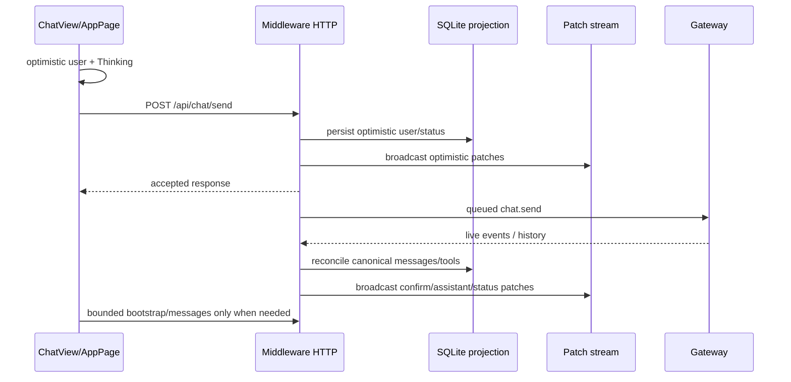
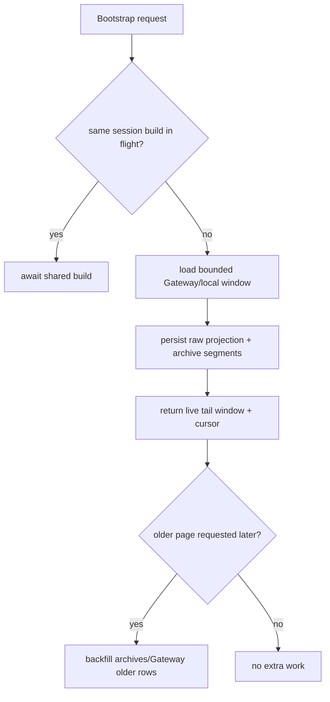

# perf: Harden chat middleware fast path

## Summary

Make the desktop chat path faster and safer by restoring the broken projection/bootstrap invariants first, then tightening the latency-sensitive middleware/frontend handoff around send acknowledgement, stream recovery, and history hydration.

---

## Problem Frame

The visible issue is that Desktop can feel slower than Telegram when a chat response has to travel through middleware before the frontend updates. Current inspection shows the primary send path already paints optimistically and returns `/api/chat/send` before Gateway work completes, but the broader middleware projection layer has failing tests around archive import, bootstrap windowing, tool projection, fork bootstrap, and session cursor handling. Those failures are directly in the same paths that protect fast refreshes, missed-live-event recovery, and stale stream recovery, so performance work must start by restoring those invariants rather than layering new shortcuts over a broken baseline.

---

## Requirements

**Safety and compatibility**

- R1. Preserve the current optimistic send flow: user bubble and Thinking state render before Gateway `chat.send` finishes.
- R2. Preserve existing chat semantics for attachments, exec policy, stop/abort, send serialization, duplicate user echo suppression, and missed-live-event reconciliation.
- R3. Fix existing middleware test regressions before adding new behavior so performance changes do not mask projection correctness bugs.

**Performance and recovery**

- R4. Avoid unnecessary cold bootstrap work when multiple frontend requests ask for the same session concurrently.
- R5. Keep initial bootstrap bounded to the live tail while still preserving older/archive availability through `/api/chat/messages` pagination.
- R6. Avoid stale or global projection cursors causing needless bootstrap recovery, flicker, or refetch loops.
- R7. Keep historical tool-call projection available after bootstrap without resurrecting stale active tools.

**Verification**

- R8. Add/restore tests for every changed middleware and frontend boundary.
- R9. Verify typecheck, build where host resources allow, middleware tests, UI chat tests, and a live manual user flow with console/network evidence before pushing.

---

## High-Level Technical Design

---

## Key Technical Decisions

- **Correctness before speed:** Fix the 18 failing middleware tests first; otherwise any speed improvement could simply skip correctness checks that the UI relies on during refresh/recovery.
- **Bounded first paint, complete storage:** Return a bounded live-tail window to frontend, but keep importing/persisting archive and Gateway history so older pagination remains correct.
- **Session-scoped cursors:** Bootstrap responses should report the latest meaningful session cursor, not a cursor polluted by the bootstrap event itself or unrelated sessions.
- **Run-detached historical tools:** Historical tool calls should render as completed history/tool projections without becoming active pending tools unless a current active run owns them.
- **Instrumentation over guessing:** Performance claims should be measured with existing `frontendLog`/middleware lifecycle markers and one added summary point if a gap remains.

---

## Implementation Units

### U1. Restore middleware baseline invariants

- **Goal:** Make the current full middleware test suite green before adding latency changes.
- **Requirements:** R2, R3, R7, R8
- **Dependencies:** None
- **Files:**
  - `apps/middleware/src/features/chat/routes.ts`
  - `apps/middleware/src/features/chat/live.ts`
  - `apps/middleware/src/features/chat/projection.ts`
  - `apps/middleware/src/features/chat/repo.messages.ts`
  - `apps/middleware/tests/app.test.ts`
  - `apps/middleware/tests/bootstrap-dedupe.test.ts`
  - `apps/middleware/tests/bootstrap-tool-inference.test.ts`
  - `apps/middleware/tests/fork.test.ts`
  - `apps/middleware/tests/live.test.ts`
  - `apps/middleware/tests/send.test.ts`
- **Approach:** Treat the current failures as regression characterization: archive segments are not imported into bootstrap output, bootstrap dedupe is disabled, initial windows are over-returning, historical tool projection is missing, stale tool runs remain active, and cursor reporting includes a bootstrap self-event. Repair those behaviors with targeted changes only.
- **Execution note:** Characterization-first: run each failing test file before and after the targeted fix.
- **Patterns to follow:** Existing helpers `persistArchivedHistorySegments`, `projectArchivedToolsFromMessages`, `buildChatBootstrapSnapshot`, `latestSessionCursor`, and send reconciliation tests.
- **Test scenarios:**
  - Concurrent cold bootstraps for one session call Gateway `chat.history` once and share the result.
  - Bootstrap with a 298-message history returns a 160-message live tail and reports older availability.
  - Older-page request backfills rows when SQLite only has the recent window.
  - Archive reset/deleted JSONL files import into separate file-keyed segments, preserving valid records when one line is malformed.
  - Historical assistant tool blocks create completed tool projections with real result output.
  - Stale active tool runs are finalized or detached when canonical bootstrap proves the session is done.
  - Bootstrap cursor equals the latest session-scoped event cursor visible before the bootstrap response.
- **Verification:** The previously failing test files pass individually, then the full middleware test suite passes.

### U2. Tighten bootstrap/window fast path

- **Goal:** Reduce frontend wait time on chat open by ensuring bootstrap does bounded work and older history loads only on demand.
- **Requirements:** R4, R5, R8
- **Dependencies:** U1
- **Files:**
  - `apps/middleware/src/features/chat/routes.ts`
  - `apps/middleware/src/features/chat/repo.messages.ts`
  - `apps/middleware/tests/bootstrap-dedupe.test.ts`
  - `packages/ui/components/ChatView/index.tsx`
  - `packages/ui/lib/chat-engine-v2/messageWindow.ts`
  - `packages/ui/lib/chat-engine-v2/__tests__/messageWindow.test.ts`
- **Approach:** Keep the first bootstrap bounded to the same live-tail assumptions the UI virtualization expects, expose `oldestLoadedSeq/newestLoadedSeq/historyCoverage`, and use `/api/chat/messages` for older pages. Do not reintroduce full-history bootstrap payloads.
- **Patterns to follow:** Existing `liveTailQuery`, `applyInitialPage`, `fetchChatMessagesV2`, and ChatView older/newer autoload logic.
- **Test scenarios:**
  - Initial bootstrap for long history returns the live tail only.
  - Older-page fetch returns older rows without reloading the visible live tail.
  - Refresh of an active run keeps optimistic/running state even when Gateway history lags.
- **Verification:** Targeted bootstrap and UI message-window tests pass; manual chat open on a long session avoids a full history payload.

### U3. Harden stream recovery and cursor semantics

- **Goal:** Prevent stale patch cursors and replay-window recovery from causing avoidable skeleton/flicker loops.
- **Requirements:** R1, R6, R8
- **Dependencies:** U1
- **Files:**
  - `apps/middleware/src/features/patches.ts`
  - `apps/middleware/src/features/chat/routes.ts`
  - `apps/middleware/tests/patch-stream.test.ts`
  - `apps/middleware/tests/send.test.ts`
  - `packages/ui/lib/chat-engine-v2/client.ts`
  - `packages/ui/lib/chat-engine-v2/store.ts`
  - `packages/ui/lib/chat-engine-v2/__tests__/store.test.ts`
  - `packages/ui/components/ChatView/index.tsx`
- **Approach:** Preserve the current WS hello/replay contract but make recovery decisions based on session-scoped cursor validity and recent successful bootstrap/live-tail state. The client should reset from dead epochs and suppress redundant recovery, not repeatedly blank the same session.
- **Patterns to follow:** Existing `openclaw:chat-bootstrap-recovery`, `lastBootstrapCompletedAtRef`, and stream hello `latestCursor` handling.
- **Test scenarios:**
  - WS hello with stale cursor ahead of backend epoch triggers one recovery, not repeated resets.
  - Bootstrap cursor does not advance solely because bootstrap emitted its own metadata event.
  - Active optimistic send suppresses redundant recovery while live patches are arriving.
- **Verification:** Patch-stream/send/store tests pass and manual devtools logs show at most one recovery event for a stale stream reconnect.

### U4. Add latency evidence and guarded diagnostics

- **Goal:** Make the end-to-end desktop latency measurable without logging user message content.
- **Requirements:** R8, R9
- **Dependencies:** U1, U2, U3
- **Files:**
  - `packages/ui/components/ChatView/index.tsx`
  - `packages/ui/components/AppPage.tsx`
  - `packages/ui/lib/clientLogs.ts`
  - `apps/middleware/src/features/chat/routes.ts`
  - `apps/middleware/tests/send.test.ts`
  - `packages/ui/lib/__tests__/clientLogs.test.ts`
- **Approach:** Reuse existing lifecycle logs (`click`, optimistic render, request fired, send accepted, first patch received) and add missing elapsed fields only where the current chain has a gap. Logs must include timings, session key, cursor/run IDs, counts, and status, but never raw prompt text.
- **Patterns to follow:** Existing `chat-rebuild.send.*`, `middleware.fetch.*`, and middleware `elapsedSinceRequestMs` logging.
- **Test scenarios:**
  - Send lifecycle logs include elapsed timings without prompt content.
  - First patch received log fires once per mounted session/send.
  - Middleware send accepted log appears before Gateway completion in async-send tests.
- **Verification:** Tests pass and manual log snippet proves click-to-first-patch measurement exists.

### U5. End-to-end verification and release push

- **Goal:** Prove the work improves speed without breaking current chat flows, then commit and push to `v6-3-krish`.
- **Requirements:** R1, R2, R9
- **Dependencies:** U1, U2, U3, U4
- **Files:**
  - `docs/plans/2026-06-19-001-perf-chat-middleware-fast-path-plan.md`
  - `docs/solutions/` if a concise solution note is useful after implementation
- **Approach:** Run targeted tests first, then full package gates. For browser evidence, start middleware/UI, send a message, watch the optimistic render, first patch, assistant stream, and final status with devtools console/network clean for the touched flow.
- **Test scenarios:**
  - Existing desktop send flow sends a message and receives streaming/final assistant updates.
  - Refresh during an active run preserves running state and messages.
  - Long history opens quickly with bounded live tail and older-page autoload still works.
  - Archive-backed session includes older messages and completed tools after refresh.
- **Verification:** Middleware typecheck/test pass, UI typecheck/relevant tests pass, build attempted with host limitation documented if memory blocks it, browser/manual evidence captured, git commit pushed to `origin/v6-3-krish`.

---

## Scope Boundaries

- In scope: middleware projection correctness, bounded bootstrap, stream/cursor recovery, latency-safe instrumentation, tests, verification, commit, and push.
- Out of scope: changing Gateway/provider model latency, redesigning chat UI visuals, replacing WebSocket transport, or changing Telegram/OpenClaw external protocol behavior.
- Deferred to follow-up work: deeper database indexing or persistent cache redesign if measurements after this pass show the bottleneck is SQLite query shape rather than bootstrap/recovery churn.

---

## System-Wide Impact

This work touches the canonical chat projection boundary used by Desktop refresh, live streaming, archive import, forked sessions, and long-history virtualization. The key risk is over-optimizing by skipping history/projection work the UI still needs for recovery. The plan therefore keeps raw projection storage complete while making the visible first payload bounded and recovery-triggered work narrower.

---

## Risks & Dependencies

- **Regression risk:** Bootstrap and live projection are tightly coupled; targeted tests must stay green before broader changes land.
- **Measurement risk:** Perceived latency can come from Gateway/provider response time, which this pass cannot reduce; instrumentation must separate frontend/middleware latency from model latency.
- **Host limitation:** Full UI build may hit known memory limits on this host; if so, document the exact failure and still run typecheck, targeted tests, and browser/manual flow where possible.

---

## Sources & Research

- `apps/middleware/src/features/chat/routes.ts` — send, bootstrap, messages, archive import, cursor return.
- `apps/middleware/src/features/chat/live.ts` — live Gateway event ingestion, optimistic confirmation, stale run repair.
- `apps/middleware/src/features/patches.ts` — WebSocket replay and recovery contract.
- `packages/ui/lib/chat-engine-v2/client.ts` — frontend middleware fetch and patch stream client.
- `packages/ui/components/ChatView/index.tsx` — optimistic send, bootstrap recovery, virtualization, first-patch diagnostics.
- Baseline test run: 18 current middleware failures across `app.test.ts`, `bootstrap-dedupe.test.ts`, `bootstrap-tool-inference.test.ts`, `fork.test.ts`, `live.test.ts`, and `send.test.ts`.
