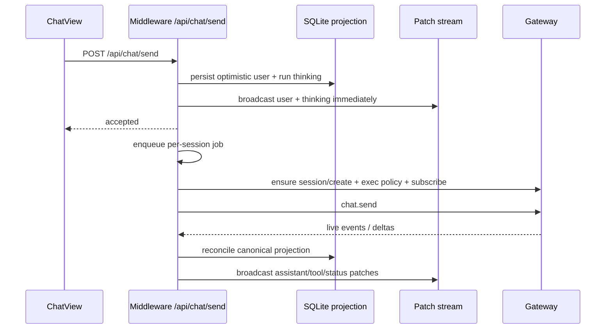
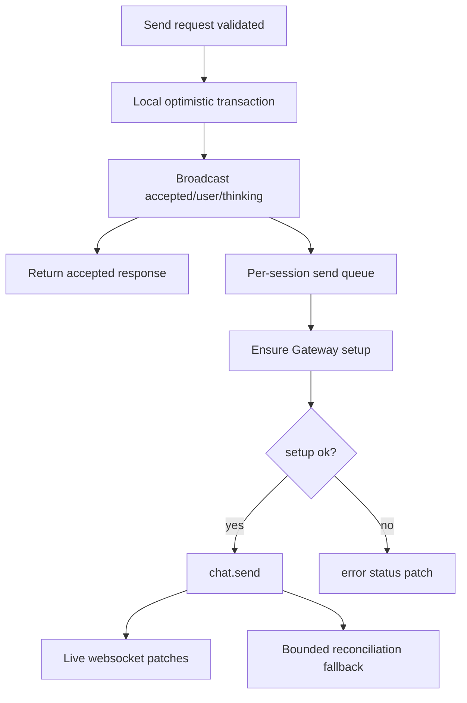

# perf: Accelerate chat send and websocket feedback loop

## Summary

Improve perceived chat reply speed after the user presses send by shortening the path from click to visible user bubble, Thinking state, and first live websocket update. This plan intentionally preserves the stabilized cache, bootstrap, archive import, and virtualization contracts shipped in `0a1392f4`.

The main strategy is to move the local optimistic acknowledgement to the very front of `/api/chat/send`, make Gateway setup work non-blocking where safe, and keep live websocket reconciliation reliable through explicit readiness/fallback rules.

---

## Problem Frame

Desktop already has an optimistic/send-queue architecture, but the middleware send route still performs Gateway-dependent setup before it emits the local optimistic patches. In `apps/middleware/src/features/chat/routes.ts`, `/api/chat/send` currently waits for session creation, optional session patching, and `sessions.messages.subscribe` before inserting/broadcasting the optimistic user message and Thinking status. Those calls can add visible latency before the UI receives the first websocket patch.

Recent stabilization made bootstrap and virtualization safer: the UI expects an initial 160-message live tail, older history via `/api/chat/messages`, session-scoped cursors, and guarded bootstrap recovery. The next performance pass must not regress those invariants.

---

## Non-Negotiable Stability Contracts

- Preserve `MAX_LOADED = 160` and `INITIAL_PAGE = 160` in `packages/ui/components/ChatView/messageWindow.ts`.
- Preserve `fetchChatBootstrapV2(...limit=160)` in `packages/ui/lib/chat-engine-v2/client.ts`.
- Preserve bounded bootstrap + older-page behavior in `apps/middleware/src/features/chat/routes.ts` and `apps/middleware/tests/bootstrap-dedupe.test.ts`.
- Preserve `historyCoverage`, `hasOlder`, `oldestLoadedSeq`, `knownTotalMessages`, and before/after sequence semantics.
- Preserve `openclaw:chat-bootstrap-recovery` guards and session-scoped cursor behavior.
- Preserve optimistic echo reconciliation, duplicate user echo suppression, attachment display semantics, stop/abort behavior, exec policy behavior, and send serialization.
- Do not replace websocket transport or bypass Gateway semantics.

---

## Requirements

**Latency and user perception**

- R1. User bubble and Thinking state must be persisted and broadcast before any Gateway session create/patch/subscribe round-trip is awaited, except for validation failures.
- R2. `/api/chat/send` should return accepted quickly after local persistence and enqueueing, not after Gateway model work.
- R3. Active-session websocket delivery should remain the primary live path; history reconciliation should be a safety net, not the normal first-update dependency.
- R4. First assistant delta should render as soon as middleware ingests it, without unnecessary bootstrap recovery, history reload, or non-active-session batching delay.

**Safety and compatibility**

- R5. Gateway setup must still happen before the actual queued `chat.send` call when required for correctness: session create, exec-policy patch, and live subscription readiness must be ordered deliberately.
- R6. If async setup fails, the user-visible run must transition to error with the existing error patch semantics.
- R7. Send queue ordering per session must remain serialized.
- R8. Caching, virtualization, archive import, and older/newer page loading must behave exactly as before.
- R9. No user prompt/message content should be added to new logs.

**Verification**

- R10. Add tests proving optimistic patches are emitted before delayed Gateway setup resolves.
- R11. Add tests proving queued `chat.send` waits for required setup before sending to Gateway.
- R12. Add tests proving cache/virtualization contracts are unchanged.
- R13. Capture runtime timing evidence: click/send start, optimistic patch, send accepted, subscribe ready, `chat.send` start, first assistant delta, final status.

---

## High-Level Technical Design

---

## Key Technical Decisions

- **Optimistic first, Gateway setup second:** The local UI acknowledgement is a middleware-owned projection and should not depend on `sessions.create` or subscribe latency. Gateway work still gates actual `chat.send` inside the per-session queue.
- **Preserve send queue as the ordering boundary:** Do not parallelize multiple sends for the same session. Faster acknowledgement should not mean concurrent Gateway sends.
- **Keep subscription reliability, but do not block first paint:** `ensureSessionSubscribed` should be moved into the queued job before `chat.send`, with recovery/history fallback if live subscribe or live delta delivery lags.
- **No virtualization contract changes:** This pass must not alter message window constants, initial bootstrap limit, older-page query shape, or message eviction behavior.
- **Measure before claiming speed:** Add/use timing logs so improvements can be validated with actual click-to-optimistic and click-to-first-delta timing.

---

## Implementation Units

### U1. Characterize current send latency ordering

- **Goal:** Lock in the current ordering as a failing characterization so the fast-ack refactor has a clear behavioral target.
- **Requirements:** R1, R2, R10, R11
- **Dependencies:** None
- **Files:**
  - `apps/middleware/src/features/chat/routes.ts`
  - `apps/middleware/tests/send.test.ts`
- **Approach:** Add a test that delays `sessions.create` and `sessions.messages.subscribe`, calls `/api/chat/send`, and asserts the optimistic projection/event is available before those Gateway promises resolve. The test should fail against the current route shape and pass after U2.
- **Patterns to follow:** Existing async send tests in `apps/middleware/tests/send.test.ts` around optimistic user confirmation, queue behavior, abort, and bootstrap after send.
- **Test scenarios:**
  - New-session send emits optimistic user/status before `sessions.create` resolves.
  - Existing-session send emits optimistic user/status before `sessions.messages.subscribe` resolves.
  - Send response returns accepted while Gateway setup is still pending.
- **Verification:** Targeted `send.test.ts` cases fail before U2 and pass after U2.

### U2. Refactor `/api/chat/send` into fast local accept + queued Gateway setup

- **Goal:** Move local optimistic persistence/broadcast to the front of the route while keeping Gateway setup ordered before actual `chat.send`.
- **Requirements:** R1, R2, R5, R6, R7, R9, R10, R11
- **Dependencies:** U1
- **Files:**
  - `apps/middleware/src/features/chat/routes.ts`
  - `apps/middleware/tests/send.test.ts`
- **Approach:** Split the route into clear phases:
  1. Validate body and prepare local message/attachment display metadata.
  2. Insert run + optimistic user message + session running state.
  3. Broadcast optimistic message/status and return accepted.
  4. In `sendQueue.run`, perform `sessions.create` if needed, apply exec policy, ensure live subscription, then call `chat.send`.
  5. On any setup/send error, reuse existing run error/session error/broadcast semantics.
- **Patterns to follow:** Existing local optimistic insert/event blocks in `apps/middleware/src/features/chat/routes.ts`; existing `sendQueue.run` and error-patch branches.
- **Test scenarios:**
  - `chat.send` does not fire until delayed session create finishes for a new session.
  - `chat.send` does not fire until exec policy patch finishes when `execPolicy` is provided.
  - Setup failure produces `chat.run.error`/`chat.status` and does not leave run stuck in Thinking.
  - Stop command remains immediate and does not regress abort semantics.
  - Duplicate/idempotent send behavior is unchanged.
- **Verification:** Targeted send tests pass; logs show optimistic broadcast before `session.create.start/end` or subscribe completion on delayed setup tests.

### U3. Make live subscription readiness non-blocking for first paint but reliable for first delta

- **Goal:** Preserve live websocket reliability while avoiding subscribe as a user-visible first-paint dependency.
- **Requirements:** R3, R5, R6, R11, R13
- **Dependencies:** U2
- **Files:**
  - `apps/middleware/src/features/chat/live.ts`
  - `apps/middleware/src/features/chat/routes.ts`
  - `apps/middleware/tests/live.test.ts`
  - `apps/middleware/tests/send.test.ts`
- **Approach:** Keep `ensureSessionSubscribed` idempotent. Invoke it inside the queued Gateway job before `chat.send` for normal sends. If it fails, transition the run to error unless existing behavior intentionally tolerates that failure. Consider adding an internal `ensureSessionSubscribedSoon(sessionKey)` only if tests show pre-warming helps without weakening correctness.
- **Patterns to follow:** `ChatLiveIngest.ensureSessionSubscribed`, `handleGatewayEvent`, and existing live ingest tests for assistant delta/tool/status patches.
- **Test scenarios:**
  - Existing subscribed session skips Gateway subscribe and reaches `chat.send` immediately.
  - Unsubscribed session subscribes before `chat.send` in queued job.
  - Subscribe failure does not silently drop the send into a permanently running state.
  - Live assistant delta still attaches to the optimistic run and replaces/merges correctly.
- **Verification:** `send.test.ts` and relevant `live.test.ts` cases pass; manual logs show `send.accepted` precedes subscribe completion, while `gateway.chat.send.start` follows subscribe readiness.

### U4. Reduce reconciliation cost after successful `chat.send`

- **Goal:** Keep canonical history repair without making every send pay the full reconciliation cost before useful live updates are visible.
- **Requirements:** R3, R4, R8, R12
- **Dependencies:** U2, U3
- **Files:**
  - `apps/middleware/src/features/chat/routes.ts`
  - `apps/middleware/src/features/chat/live.ts`
  - `apps/middleware/tests/send.test.ts`
  - `apps/middleware/tests/bootstrap-dedupe.test.ts`
  - `apps/middleware/tests/live.test.ts`
- **Approach:** Review the current post-send `chat.history` reconciliation. Prefer one of these safe paths, in order:
  1. Keep reconciliation but lower the send-local history limit if tests show current message/final assistant are still captured.
  2. Delay non-critical history reconciliation into a background task when live events already produced a final assistant/status.
  3. Keep full reconciliation only for cases without final live evidence, missing assistant output, or tool-call-only histories.
- **Patterns to follow:** Existing `currentHistory`/projection logic in `/api/chat/send`, `backfillHistory` in `ChatLiveIngest`, and bootstrap tool inference tests.
- **Test scenarios:**
  - Completed `chat.send` with final live assistant does not duplicate assistant rows after delayed reconciliation.
  - Tool-call-only assistant history is not misinterpreted as final text.
  - Archive/canonical tool projection remains completed for historical rows.
  - Older-page and bootstrap tests still pass unchanged.
- **Verification:** Middleware full chat suite passes; no change to `historyCoverage`/pagination assertions.

### U5. Optimize active-session UI notification for first optimistic patch and first assistant delta

- **Goal:** Make the active chat feel immediate while preserving rAF batching for noisy tool/delta bursts and non-active sessions.
- **Requirements:** R4, R8, R12, R13
- **Dependencies:** U2
- **Files:**
  - `packages/ui/lib/chat-engine-v2/store.ts`
  - `packages/ui/lib/chat-engine-v2/__tests__/store.test.ts`
  - `packages/ui/components/ChatView/index.tsx`
  - `packages/ui/components/ChatView/__tests__/messageWindow.test.ts`
- **Approach:** Keep the existing rAF batching default. Add a narrowly-scoped immediate flush path only for the foreground active session when receiving first-send/first-assistant semantic patches, if measurement shows the rAF delay matters. Do not immediate-flush tool update bursts.
- **Patterns to follow:** Existing `notify`, `flushNotifications`, `notifyNow`, active-session handling, and message-window tests.
- **Test scenarios:**
  - Active session receives first optimistic user/status without waiting for a later unrelated patch.
  - Tool update bursts remain batched.
  - Window state (`hasOlder`, `oldestLoadedSeq`, eviction behavior) is unchanged.
  - Bootstrap recovery still resets to live tail only when guard permits.
- **Verification:** UI store/message-window tests pass; manual devtools timing shows active chat render follows websocket patch immediately or within one frame.

### U6. Add latency instrumentation without logging content

- **Goal:** Provide evidence for click-to-optimistic, send-accepted, subscribe-ready, `chat.send` start, first-delta, and final-status timing.
- **Requirements:** R9, R13
- **Dependencies:** U2, U3, U5
- **Files:**
  - `apps/middleware/src/features/chat/routes.ts`
  - `apps/middleware/src/features/chat/live.ts`
  - `packages/ui/components/ChatView/index.tsx`
  - `packages/ui/lib/clientLogs.ts`
  - `packages/ui/lib/__tests__/clientLogs.test.ts`
  - `apps/middleware/tests/send.test.ts`
- **Approach:** Reuse existing `elapsedSinceRequestMs`, `middleware.fetch.*`, `patch-stream.event`, and `assistant.delta.broadcast` logs. Add missing fields only where the timing chain has gaps. Logs should include IDs, status, counts, cursor, and elapsed timing; never raw prompt text.
- **Patterns to follow:** Existing `frontendLog`, `redactText`, middleware `log.info` style, and sanitized URL/body logging.
- **Test scenarios:**
  - Send lifecycle logs contain timings and identifiers but no message content.
  - First assistant delta log fires once per run/session.
  - Error path logs enough timing to distinguish setup failure from provider/model failure.
- **Verification:** Client log tests and send tests pass; manual log snippet can show the timing chain.

### U7. End-to-end verification and guarded release

- **Goal:** Ship only after proving the fast path is faster and cache/virtualization remain stable.
- **Requirements:** R8, R10, R11, R12, R13
- **Dependencies:** U1-U6
- **Files:**
  - `docs/plans/2026-06-19-002-chat-send-websocket-latency-plan.md`
  - `docs/solutions/` if a concise post-implementation note is useful
- **Approach:** Run targeted tests after each unit, then full gates. Because this host has known low-RAM/no-swap issues, treat any `EAGAIN`, `Cannot fork`, or Next build SIGTERM as host-blocked and rerun on a larger host before claiming final full UI build success.
- **Test scenarios:**
  - New chat send: user bubble and Thinking appear immediately, then assistant streams/finalizes.
  - Existing chat send: no create overhead on optimistic acknowledgement.
  - Exec policy send: optimistic acknowledgement immediate, Gateway `chat.send` waits until patch completes.
  - Active run refresh: running state and live-tail messages remain stable.
  - Long history: initial load remains 160 live-tail, older autoload still works.
  - Archive-backed session: older messages and completed tool projections remain correct.
- **Verification:**
  - `pnpm --filter @openclaw/desktop-middleware exec tsc --noEmit --pretty false`
  - `pnpm --filter @openclaw/desktop-middleware build`
  - Targeted middleware tests: `send.test.ts`, `live.test.ts`, `bootstrap-dedupe.test.ts`, `bootstrap-tool-inference.test.ts`, `app.test.ts`, `fork.test.ts`
  - Full middleware test suite when host allows.
  - `pnpm --filter ui typecheck`
  - Targeted UI tests: chat-engine store, ChatView messageWindow, bootstrapRecoveryGuard, clientLogs.
  - UI build on a host with enough RAM/swap.
  - Manual browser/devtools flow with console/network clean for send, stream, refresh, long-history older load.

---

## Files and Existing Patterns to Preserve

| Area | Paths | Preserve |
| --- | --- | --- |
| Send route | `apps/middleware/src/features/chat/routes.ts` | Optimistic projection shape, send queue, stop/abort, exec policy, canonical reconciliation |
| Live ingest | `apps/middleware/src/features/chat/live.ts` | Idempotent session subscription, optimistic user matching, live assistant/tool projection |
| Patch stream | `apps/middleware/src/features/patches.ts` | Global cursor/replay contract, hello recovery, backend epoch reset handling |
| UI stream client | `packages/ui/lib/chat-engine-v2/client.ts` | `limit=160` bootstrap, websocket reconnect/backlog behavior, request scheduler priority |
| UI store | `packages/ui/lib/chat-engine-v2/store.ts` | rAF batching for bursts, session cache, bootstrap recovery dispatch |
| Virtualization | `packages/ui/components/ChatView/messageWindow.ts`, `packages/ui/components/ChatView/index.tsx` | `MAX_LOADED`, `INITIAL_PAGE`, older/newer autoload, scroll anchoring |
| Tests | `apps/middleware/tests/*.test.ts`, `packages/ui/**/__tests__/*.test.ts` | Existing bootstrap/archive/tool/send/live coverage |

---

## Explicit Non-Goals

- Do not change provider/model generation speed or Gateway protocol semantics.
- Do not increase initial bootstrap beyond 160 messages.
- Do not disable archive import, canonical history repair, or tool-call projection.
- Do not remove rAF batching globally; only consider active-session first-patch exceptions.
- Do not replace websocket with SSE or polling in this pass.
- Do not broaden UI visual redesign.

---

## Risk Register

| Risk | Why it matters | Mitigation |
| --- | --- | --- |
| Send reaches Gateway before session setup | New chats or exec policy sends could fail or use wrong policy | Keep Gateway setup inside queue before `chat.send`; add ordering tests |
| Optimistic patches duplicate canonical user echo | User sees duplicate message | Preserve `addOptimisticUser`, confirmation, and duplicate suppression tests |
| Live subscribe moved too late | First assistant delta could be missed | Subscribe before `chat.send`; keep bounded history reconciliation fallback |
| Immediate UI notify causes render churn | Tool bursts can jank | Limit immediate flush to active first-send/first-delta only; keep burst batching |
| Reconciliation reduced too much | Tool-only/final histories may be wrong after refresh | Gate delayed/reduced history by live evidence; keep bootstrap/tool inference tests |
| Cache/window regression | Long chats flicker or lose older paging | Treat message-window tests and bootstrap-dedupe tests as release blockers |

---

## Measurement Plan

Capture these timings per send without message content:

- `ui.send.click` or existing ChatView send-start marker.
- `middleware.fetch.start` for `/api/chat/send`.
- `send.start` in middleware.
- `optimistic.patch.broadcast` elapsed from send start.
- HTTP accepted response duration.
- `session.create/patch/subscribe` durations inside queue.
- `gateway.chat.send.start` elapsed from send start.
- first `assistant.delta.broadcast` elapsed from send start.
- UI `patch-stream.event` for first assistant delta.
- final status elapsed.

Success target for this pass: local optimistic acknowledgement should no longer include Gateway setup time. First assistant delta remains provider/Gateway-dependent, but middleware should not add avoidable setup or recovery latency.

---

## Execution Notes

- Execute U1 and U2 together with characterization-first tests.
- Keep changes small and staged; do not mix reconciliation optimization with send-route refactor until the fast-ack tests pass.
- After every middleware change touching send/live/bootstrap, run the targeted middleware tests before UI work.
- If host resource limits block Vitest/UI build, record exact output and rerun final gates on a larger host before claiming complete verification.
